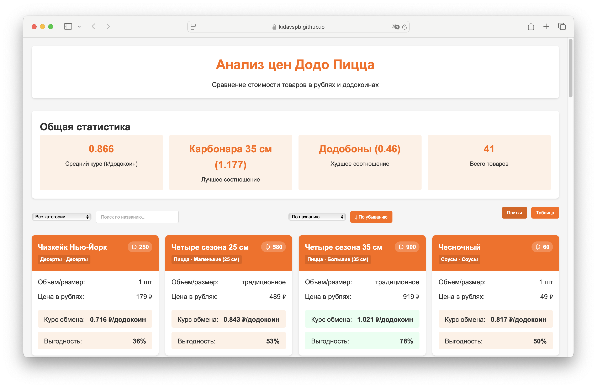

# Додо Анализатор 🍕💰

Веб-приложение для анализа соотношения цен в рублях и додокоинах в сети пиццерий «Додо Пицца».

## 📑 О проекте

Додо Анализатор позволяет сравнить стоимость различных товаров в двух валютах: рублях и додокоинах (бонусной валюте Додо Пиццы). 

Приложение вычисляет курс обмена для каждого товара и позволяет определить наиболее выгодные для использования додокоинов позиции.



## 🔍 Возможности

- Наглядное сравнение цен на разные категории товаров, визуальное выделение товаров с лучшей и худшей выгодностью
- Фильтрация по категориям и размеру пиццы
- Сортировка по различным параметрам (название, цена, курсу обмена и т.д.)
- Поиск по названию товара
- Два режима просмотра: карточки и таблица

## 🛠️ Технологии

- HTML5 и CSS3 — структура и стили
- JavaScript (ES6+) — логика и интерфейс
- JSON — хранение данных о товарах

## 📱 Как использовать

1. Откройте [веб-приложение](https://kidavspb.github.io/dodocoins/)
2. Используйте фильтры для выбора интересующей категории
3. Сравните курсы обмена и показатели выгодности
4. Принимайте более обоснованные решения при заказе в Додо Пицца!

## 📊 Метрики выгодности

Приложение рассчитывает следующие метрики:
- **Курс обмена**: Соотношение рублей к додокоинам для каждого товара (₽/додокоин)
- **Выгодность**: Нормализованное значение от 0% до 100%, показывающее относительную выгоду использования додокоинов для покупки (чем выше, тем выгоднее)

## 🤔 Выводы из анализа

- Соусы? и напитки, как правило, невыгодно покупать за додокоины
- С ростом размера пиццы увеличивается выгодность использования додокоинов
- Большие пиццы (35 см) обычно имеют наилучший курс обмена

## 📝 Примечания

- Цены в рублях и додокоинах указаны по состоянию на март 2025 года
- Данные могут меняться в зависимости от региона и акций
- Приложение не связано с Додо Пицца, это независимый проект для анализа

## 📂 Структура проекта

```
/
├── index.html             # Основная HTML страница
├── static/                # Статические ресурсы
│   ├── style.css          # Основные стили
│   ├── dodocoin.svg       # SVG иконка додокоина
│   ├── products.json      # Данные о товарах и категориях
│   └── app.js             # Основной код приложения
├── screenshot.png         # Скриншот приложения
└── README.md              # Документация проекта
```

## 🤝 Внести свой вклад

Хотите улучшить проект?

1. Сделайте форк репозитория
2. Создайте ветку для вашей функции (`git checkout -b feature/amazing-feature`)
3. Зафиксируйте ваши изменения (`git commit -m 'Add some amazing feature'`)
4. Отправьте изменения в ветку (`git push origin feature/amazing-feature`)
5. Откройте Pull Request